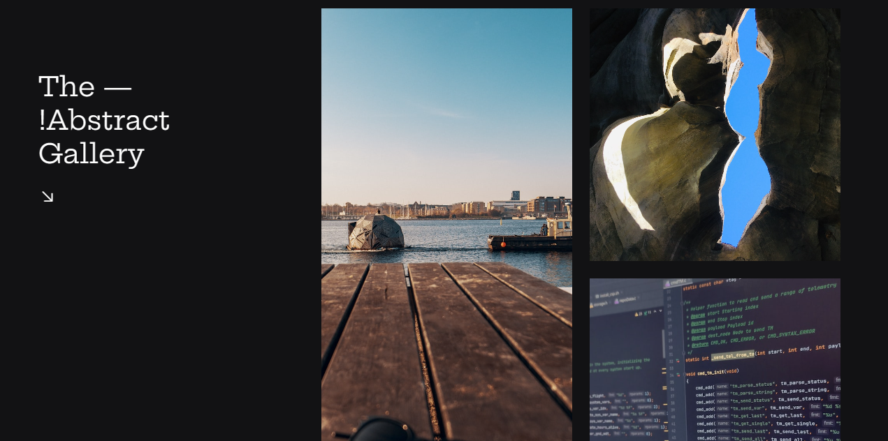

<h1 align="center">Hover Gallery</h1>

#boraCodar são desafios semanais, promovido pela Rocketseat para ensino de tecnologias e WEB. 
Esses códigos foram desenvolvidos por desenvolvedor front-end João Victor

  <a href="#-tecnologias">Tecnologias</a>&nbsp;&nbsp;&nbsp;|&nbsp;&nbsp;&nbsp;
  <a href="#-layout">Layout</a>&nbsp;&nbsp;&nbsp;|&nbsp;&nbsp;&nbsp;
  <a href="#memo-licença">Licença</a>

  

 

  

## 🚀 Tecnologias

Esse projeto foi desenvolvido com as seguintes tecnologias:

- HTML e CSS
- Git e Github
- Figma

## 🔖 Layout

Você pode visualizar o layout do projeto através [DESSE LINK](<https://www.figma.com/file/Yh0GAPGH7Kgi7PNS7y4sKd/Galeria-com-Hover-%E2%80%A2-Desafio-20-(Community)?type=design&t=9llFTsYkAS47cHwf-6>) para acessá-lo.

## :memo: Licença

Esse projeto está sob a licença MIT.

## 📞 Social Links

---
